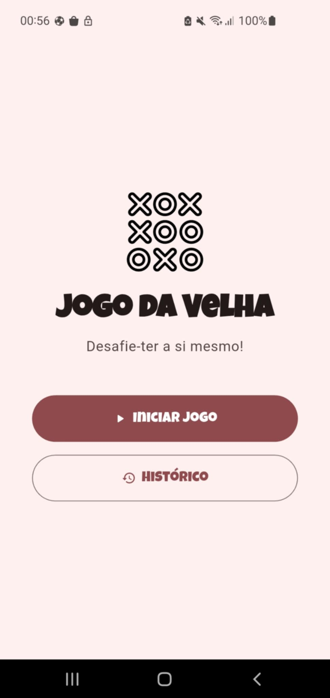
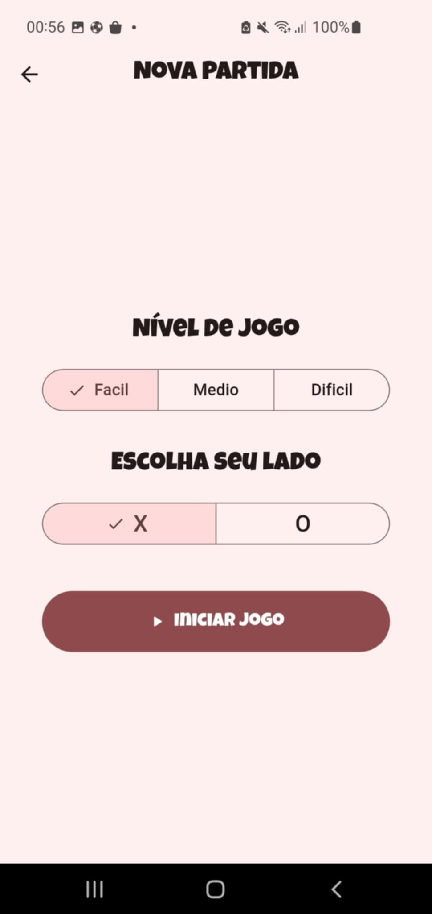
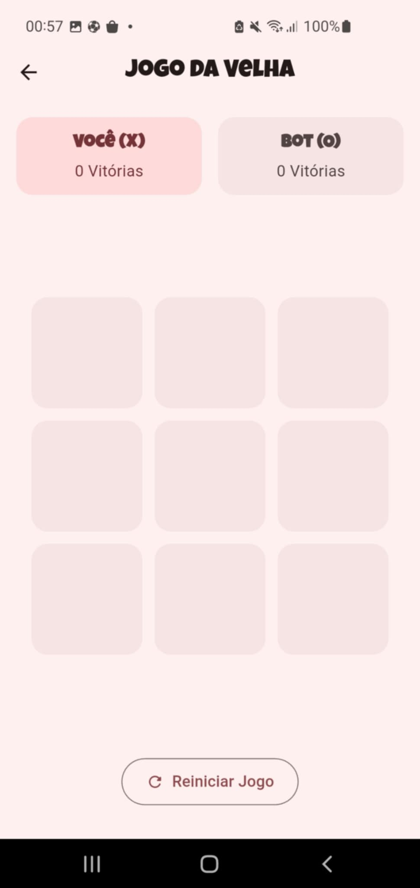
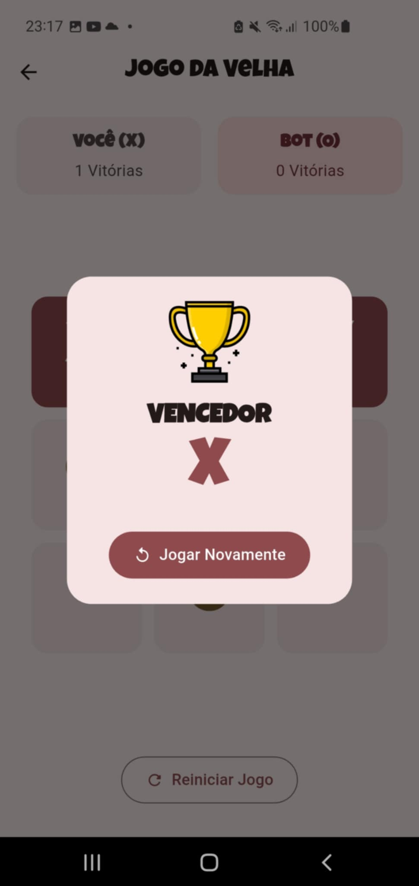

# Jogo da Velha (Tic Tac Toe)

Um jogo da velha moderno e completo, desenvolvido em Flutter, com múltiplos níveis de dificuldade e um sistema de histórico de partidas.

A modern and complete tic-tac-toe game developed in Flutter, featuring multiple difficulty levels and a match history system.

## Descrição / Description

Este projeto é uma implementação completa do clássico Jogo da Velha, onde o jogador pode desafiar a CPU. A aplicação destaca-se por um design limpo e intuitivo (Material Design 3), animações fluidas e funcionalidades robustas, como a persistência do histórico de vitórias numa base de dados local.

This project is a complete implementation of the classic Tic Tac Toe game, where the player can challenge the CPU. The application stands out for its clean and intuitive design (Material Design 3), smooth animations, and robust features, such as persisting the history of victories in a local database.

## Funcionalidades / Features

-   **Modo de Jogo Individual:** Desafie a CPU em três níveis de dificuldade: Fácil, Médio e Difícil. / **Single Player Mode:** Challenge the CPU with three difficulty levels: Easy, Medium, and Hard.
-   **Histórico de Partidas:** Todas as vitórias são guardadas localmente para que possa rever o seu desempenho. / **Match History:** All victories are saved locally so you can review your performance.
-   **Gestão de Histórico:** Elimine partidas individuais com um simples deslizar ou apague todo o histórico de uma só vez. / **History Management:** Delete individual matches with a simple swipe or clear the entire history at once.
-   **Design Moderno:** Interface limpa e intuitiva, construída com Material Design 3 e animações fluidas. / **Modern Design:** Clean and intuitive interface, built with Material Design 3 and smooth animations.

## Screenshots

| Tela Inicial | Menu de Jogo | Tela de Jogo |
| :---: | :---: | :---: |
|  |  |  |

| Tela de Vitória | Histórico de Partidas |
| :---: | :---: |
|  |  |

## Tecnologias Utilizadas / Technologies Used


-   **Flutter:** Framework para desenvolvimento de aplicações multiplataforma. / Framework for cross-platform application development.
-   **Dart:** Linguagem de programação utilizada pelo Flutter. / Programming language used by Flutter.
-   **sqflite:** Plugin para acesso a bancos de dados SQLite, usado para guardar o histórico. / Plugin for accessing SQLite databases, used to save the history.
-   **flutter_animate:** Para a criação de animações complexas de forma simples. / For creating complex animations in a simple way.

## Estrutura do Projeto / Project Structure

A estrutura do projeto segue as melhores práticas, separando as responsabilidades em diferentes diretórios para garantir um código limpo e manutenível:

The project structure follows best practices, separating responsibilities into different directories to ensure clean and maintainable code:

```
lib/
├── core/
│   ├── constants/
│   ├── controllers/
│   └── theme/
├── models/
│   └── history.dart
├── screens/
│   ├── game/
│   ├── historic/
│   ├── home/
│   ├── menu/
│   └── splash/
├── services/
│   └── database_service.dart
└── widgets/
    ├── card_history.dart
    ├── empty_history_view.dart
    ├── end_game_dialog.dart
    ├── history_list_view.dart
    ├── mark_button.dart
    ├── player_choice.dart
    ├── player_score_card.dart
    └── score_indicator.dart
```

## Como Clonar e Executar o Projeto / How to Clone and Run the Project

Siga os passos abaixo para clonar e executar este projeto na sua máquina local:

Follow the steps below to clone and run this project on your local machine:

1.  **Pré-requisitos / Prerequisites**
    *   Certifique-se de ter o [Flutter SDK](https://flutter.dev/docs/get-started/install) instalado e configurado.
    *   Ensure you have the [Flutter SDK](https://flutter.dev/docs/get-started/install) installed and configured.

2.  **Clonar o Repositório / Clone the Repository**
    ```bash
    git clone https://github.com/Leonildo-Gomes/tic-tac-toe.git
    ```

3.  **Navegar para o Diretório do Projeto / Navigate to the Project Directory**
    ```bash
    cd tic-tac-toe
    ```

4.  **Obter as Dependências / Get Dependencies**
    ```bash
    flutter pub get
    ```

5.  **Executar a Aplicação / Run the Application**
    ```bash
    flutter run
    ```
    Certifique-se de ter um emulador ou dispositivo físico conectado e configurado.
    Ensure you have an emulator or physical device connected and configured.
