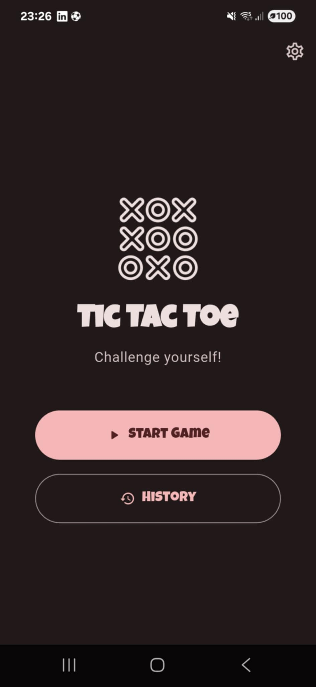
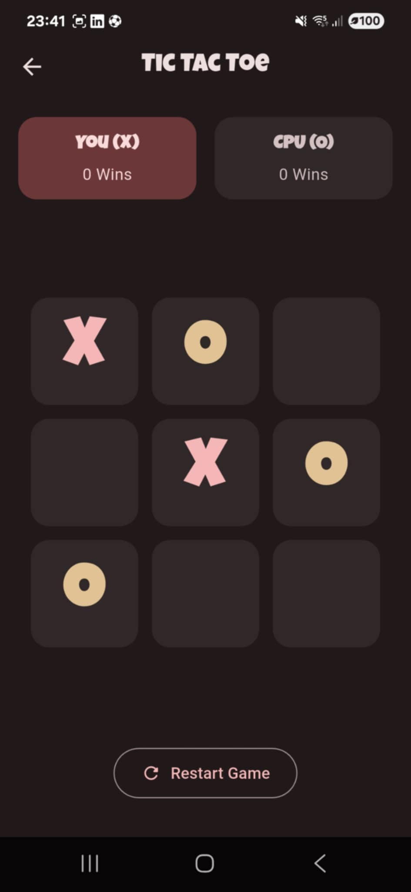
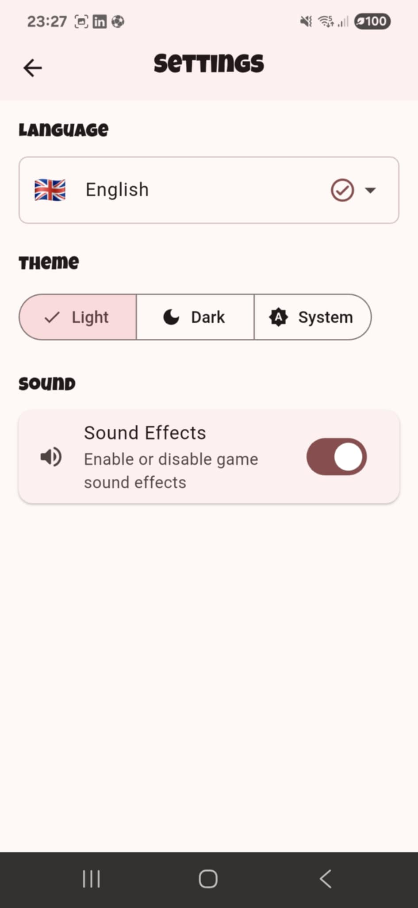

# Jogo da Velha (Tic Tac Toe)

Um jogo da velha moderno e completo, desenvolvido em Flutter, com um design elegante, múltiplas opções de personalização e um sistema de histórico de partidas.

*A modern and complete tic-tac-toe game developed in Flutter, featuring an elegant design, multiple customization options, and a match history system.*

---

## ✨ Funcionalidades / Features

-   **Modo de Jogo Individual:** Desafie a CPU em três níveis de dificuldade: Fácil, Médio e Difícil.
    -   *Challenge the CPU with three difficulty levels: Easy, Medium, and Hard.*
-   **Personalização de Tema:** Escolha entre os temas Claro, Escuro ou o padrão do Sistema.
    -   *Choose between Light, Dark, or the System default theme.*
-   **Suporte Multilíngue:** Interface disponível em Português, Inglês e Norueguês.
    -   *Interface available in Portuguese, English, and Norwegian.*
-   **Histórico de Partidas:** Todas as vitórias são guardadas localmente para que possa rever o seu desempenho.
    -   *All victories are saved locally so you can review your performance.*
-   **Gestão de Histórico:** Elimine partidas individuais com um simples deslizar ou apague todo o histórico de uma só vez.
    -   *Delete individual matches with a simple swipe or clear the entire history at once.*
-   **Design Moderno:** Interface limpa e intuitiva, construída com Material Design 3 e animações fluidas.
    -   *Clean and intuitive interface, built with Material Design 3 and smooth animations.*
---
## 🧠 Gerenciamento de Estado com Riverpod

O estado da aplicação é gerenciado utilizando [Riverpod](https://riverpod.dev), uma solução robusta e escalável para Flutter.

- A pasta `lib/providers/` organiza os provedores por responsabilidade (tema, idioma, lógica do jogo).
- Provedores como `StateNotifierProvider` são utilizados para encapsular a lógica do jogo e reagir a mudanças de estado.
- O app é inicializado com `ProviderScope`, permitindo o acesso a qualquer provedor no widget tree.

Exemplo de uso:
```dart
final gameControllerProvider = StateNotifierProvider<GameController, GameState>((ref) {
  return GameController();
});
```
---

## 📸 Screenshots

| Home (Light) | Home (Dark) | Menu |
| :---: | :---: | :---: |
|  |  |  |

| Jogo (Light) | Jogo (Dark) | Vitória |
| :---: | :---: | :---: |
|  |  |  |

| Histórico | Configurações |
| :---: | :---: |
|  |  |

---

## 🛠️ Tecnologias Utilizadas / Technologies Used


-   **Flutter & Dart:** Framework e linguagem para desenvolvimento de aplicações multiplataforma.
-   **Riverpod:** Gerenciamento de estado reativo e robusto.
-   **sqflite:** Persistência de dados local para o histórico de partidas.
-   **shared_preferences:** Armazenamento de preferências do usuário (tema e idioma).
-   **flutter_localizations & intl:** Para suporte a múltiplos idiomas.

---

## 📂 Estrutura do Projeto / Project Structure

A estrutura do projeto segue o princípio de *feature-first*, agrupando o código por funcionalidade para garantir alta coesão e baixo acoplamento.

*The project structure follows the feature-first principle, grouping code by functionality to ensure high cohesion and low coupling.*

```
lib/
├── core/                 # Lógica de negócio, enums, temas, etc.
│   ├── enums/
│   └── theme/
├── l10n/                 # Arquivos de tradução (localização)
├── models/               # Modelos de dados (ex: History)
├── providers/            # Provedores de estado (Riverpod)
│   ├── locale/
│   └── theme/
├── screens/              # Widgets que representam telas inteiras
│   ├── game/
│   ├── historic/
│   ├── home/
│   ├── menu/
│   └── settings/
│       └── widgets/      # Widgets específicos da tela de configurações
├── services/             # Serviços (ex: DatabaseService)
└── widgets/              # Widgets reutilizáveis em toda a aplicação
```

---

## 🚀 Como Executar / How to Run

1.  **Pré-requisitos / Prerequisites**
    -   Certifique-se de ter o [Flutter SDK](https://flutter.dev/docs/get-started/install) instalado.

2.  **Clonar o Repositório / Clone the Repository**
    ```bash
    git clone https://github.com/Leonildo-Gomes/tic-tac-toe.git
    cd tic-tac-toe
    ```

3.  **Obter as Dependências / Get Dependencies**
    ```bash
    flutter pub get
    ```

4.  **Executar a Aplicação / Run the Application**
    ```bash
    flutter run
    ```