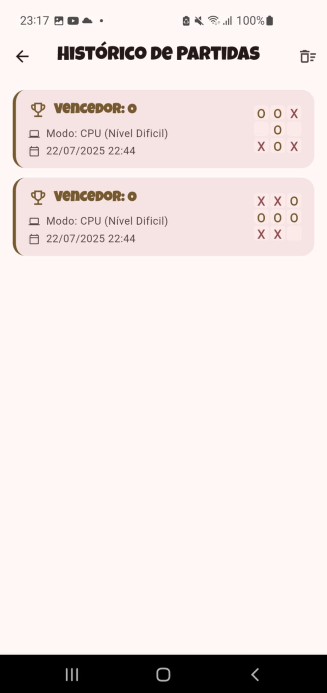

# Jogo da Velha (Tic Tac Toe)

Um jogo da velha moderno e completo, desenvolvido em Flutter, com um design elegante, múltiplas opções de personalização e um sistema de histórico de partidas.

*A modern and complete tic-tac-toe game developed in Flutter, featuring an elegant design, multiple customization options, and a match history system.*

---

## ✨ Funcionalidades / Features

-   **Modo de Jogo Individual:** Desafie a CPU em três níveis de dificuldade: Fácil, Médio e Difícil.
    -   *Challenge the CPU with three difficulty levels: Easy, Medium, and Hard.*
-   **Efeitos Sonoros:** Feedback de áudio para cliques e resultados de jogo (vitória, derrota, empate), com opção de desativar.
    -   *Audio feedback for clicks and game results (win, lose, draw), with an option to disable.*
-   **Personalização de Tema:** Escolha entre os temas Claro, Escuro ou o padrão do Sistema.
    -   *Choose between Light, Dark, or the System default theme.*
-   **Suporte Multilíngue:** Interface disponível em Português, Inglês e Norueguês.
    -   *Interface available in Portuguese, English, and Norwegian.*
-   **Histórico de Partidas:** Todas as vitórias são guardadas localmente para que possa rever o seu desempenho.
    -   *All victories are saved locally so you can review your performance.*
-   **Gestão de Histórico:** Elimine partidas individuais com um simples deslizar ou apague todo o histórico de uma só vez.
    -   *Delete individual matches with a simple swipe or clear the entire history at once.*
-   **Design Moderno:** Interface limpa e intuitiva, construída com Material Design 3 e animações fluidas.
    -   *Clean and intuitive interface, built with Material Design 3 and smooth animations.*
---
## 🧠 Arquitetura e Gestão de Estado

A aplicação utiliza [Riverpod](https://riverpod.dev) para uma gestão de estado robusta e uma arquitetura desacoplada. As responsabilidades são claramente separadas:

-   **Providers para Estado da UI:** `StateNotifierProvider` é usado para gerenciar o estado que a UI observa diretamente (ex: `soundEnabledProvider`, `themeProvider`).
-   **Providers para Serviços:** `Provider` é usado para injeção de dependência, fornecendo acesso a implementações de lógica de negócio (como `SoundService`) sem acoplar a UI aos detalhes de implementação.

Isso torna o código mais testável, modular e fácil de manter.

**Exemplos:**

*Provider para gerenciar o estado de ativação do som:*
```dart
final soundEnabledProvider = StateNotifierProvider<SoundEnabledNotifier, bool>((ref) {
  return SoundEnabledNotifier();
});
```

*Provider para injetar o serviço de áudio:*
```dart
final soundServiceProvider = Provider<SoundService>((ref) {
  final player = AudioPlayer();
  final service = SoundService(player);
  ref.onDispose(() => service.dispose());
  return service;
});
```
---

## 📸 Screenshots

| Home (Light) | Home (Dark) | Menu |
| :---: | :---: | :---: |
|  |  |  |

| Jogo (Light) | Jogo (Dark) | Vitória |
| :---: | :---: | :---: |
|  |  |  |

| Histórico | Configurações |
| :---: | :---: |
|  |  |

---

## 🛠️ Tecnologias Utilizadas / Technologies Used


-   **Flutter & Dart:** Framework e linguagem para desenvolvimento de aplicações multiplataforma.
-   **Riverpod:** Gerenciamento de estado e injeção de dependência.
-   **sqflite:** Persistência de dados local para o histórico de partidas.
-   **shared_preferences:** Armazenamento de preferências do usuário (tema, idioma, som).
-   **audioplayers:** Reprodução de efeitos sonoros.
-   **flutter_localizations & intl:** Para suporte a múltiplos idiomas.

---

## 📂 Estrutura do Projeto / Project Structure

A estrutura do projeto agrupa o código por funcionalidade para garantir alta coesão e baixo acoplamento.

*The project structure groups code by functionality to ensure high cohesion and low coupling.*

```
lib/
├── assets/               # Arquivos estáticos (imagens, sons)
│   ├── images/
│   └── sounds/
├── core/                 # Código central da app (constantes, temas, utils)
│   ├── constants/
│   ├── controllers/
│   ├── enums/
│   ├── theme/
│   └── utils/
├── l10n/                 # Arquivos de tradução (localização)
├── models/               # Modelos de dados (ex: GameState, History)
├── providers/            # Camada de estado e injeção de dependência (Riverpod)
│   ├── database/
│   ├── game/
│   ├── locale/
│   ├── sound/
│   └── theme/
├── screens/              # Widgets que representam as telas da aplicação
│   ├── game/
│   ├── historic/
│   ├── home/
│   ├── menu/
│   └── settings/
│       └── widgets/
├── services/             # Implementação de lógicas externas (ex: Database, Sound)
│   ├── database/
│   └── sound/
└── widgets/              # Widgets reutilizáveis em toda a aplicação
```

---

## 🚀 Como Executar / How to Run

1.  **Pré-requisitos / Prerequisites**
    -   Certifique-se de ter o [Flutter SDK](https://flutter.dev/docs/get-started/install) instalado.

2.  **Clonar o Repositório / Clone the Repository**
    ```bash
    git clone https://github.com/Leonildo-Gomes/tic-tac-toe.git
    cd tic-tac-toe
    ```

3.  **Obter as Dependências / Get Dependencies**
    ```bash
    flutter pub get
    ```

4.  **Executar a Aplicação / Run the Application**
    ```bash
    flutter run
    ```